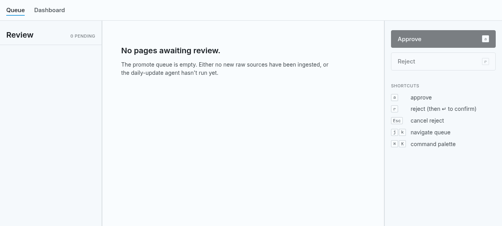

# KnowledgeBase

Personal LLM wiki. Raw sources go in, LLM writes wiki pages, lint keeps them honest.

## Architecture

KnowledgeBase separates code from data:

- **Outer repo** (`KnowledgeBase/`) — Code, lint tools, templates, documentation. Public-safe.
- **Nested repo** (`data/`) — Raw sources, wiki pages, handoff documents. Local-only, never pushed.

```
KnowledgeBase/
├── src/kb/                   CLI tools (lint, daily reports)
├── scripts/
│   └── ingest-github.sh          GitHub source collection
├── .claude/skills/               Runtime workflow contracts + bundled templates
│   ├── wiki-authoring/             Wiki page templates and authoring rules
│   ├── wiki-approval/              review_status lifecycle workflow
│   ├── knowledgebase-initialize/   Setup workflow
│   └── usage-report-setup/         Usage report mode workflow
├── templates/raw/                Raw source frontmatter templates
├── CLAUDE.md                     LLM entry point and project skill map
├── README.md                     This file
└── .gitignore                    Excludes data/

data/                             Nested git repo (local-only)
├── raw/
│   ├── github/                   CLAUDE.md, Issues, PRs
│   ├── conversations/            Desktop Chatbot history
│   ├── calendar/                 Calendar events
│   ├── web/                      Web clippings
│   └── manual/                   Hand-dropped files
├── handoffs/                     Handoff documents
├── wiki/
│   ├── entities/                 Named objects ({subject}/{YYYY-MM}/)
│   ├── concepts/                 Abstract ideas (flat)
│   ├── decisions/                Architecture Decision Records
│   ├── questions/                Saved Q&A
│   ├── improvements/             Open-ended improvements
│   ├── checklists/               Operational checklists
│   └── summaries/                Time/subject rollups
├── rejected/                     Rejected wiki pages (created by `kb-wiki-review reject`)
└── log.md                        Operation record
```

## Workflows

Project workflows live in `.claude/skills/`. Use `wiki-authoring` for source-backed wiki edits, `wiki-approval` for review lifecycle work, `memory-report` for daily/weekly/monthly synthesis, and `handoff-document` for handoffs.

## Privacy

`data/` is local-only. Never pushed to remote.

- Outer `.gitignore` excludes `data/`
- All raw sources and wiki pages stay local
- Handoff documents (sensitive decisions) stay local

## Quick Start

### Install

```bash
uv sync
```

### Ingest sources

```bash
./scripts/ingest-github.sh owner/repo
```

### Write wiki

Use `.claude/skills/wiki-authoring/SKILL.md`; read `data/raw/` and write source-backed pages to `data/wiki/`.

### Validate

```bash
kb-lint-wiki
kb-lint-handoff
```

### Commit

```bash
cd data
git add raw/ wiki/ log.md
git commit -m "ingest: [source] description"
```

### Review console (web UI)

Local-only web app for reviewing `pending_for_approve` wiki pages.
See [PRODUCT.md](PRODUCT.md) and [DESIGN.md](DESIGN.md) for the
strategic and visual specs.



```bash
# First run only — install JS deps. The script also does this for you
# if frontend/node_modules is missing.
(cd frontend && npm install)

# Run FastAPI + Vite together. Ctrl-C cleans up both.
./scripts/dev-web.sh

# Optional: point at a non-default data tree (handy in a worktree
# created from the main branch, where `data/` is not present).
KB_DATA_DIR=/path/to/data ./scripts/dev-web.sh
```

Open <http://127.0.0.1:5173>. The empty queue is honestly empty;
the UI does not fabricate placeholder content.

## Files

| File | Role |
|---|---|
| `CLAUDE.md` | LLM entry point and project skill map |
| `scripts/ingest-github.sh` | GitHub source collection |
| `src/kb/cli/lint_wiki.py` | Wiki validation |
| `src/kb/cli/lint_handoff.py` | Handoff validation |
| `src/kb/cli/wiki_review/` | Wiki page approval CLI (`kb-wiki-review`) |
| `data/log.md` | Operation record |
| `data/raw/` | Immutable sources |
| `data/wiki/` | LLM-generated pages |
| `data/handoffs/` | Handoff documents |

## Documentation

- [Documentation Index](docs/README.md) — Skill routing and design document map
- [Architecture](docs/architecture.md) — Repository layout and memory layers
- [Frontmatter](docs/reference/frontmatter.md) — Human schema reference; runtime rules live in skills
- [Wiki Categories](docs/reference/wiki-categories.md) — Human category reference; runtime uses `wiki-authoring`
- [Commands](docs/reference/commands.md) — Full CLI command reference

See [CLAUDE.md](CLAUDE.md) for the LLM entry point.
