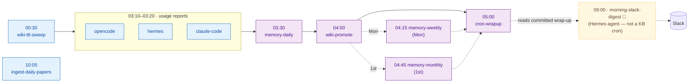
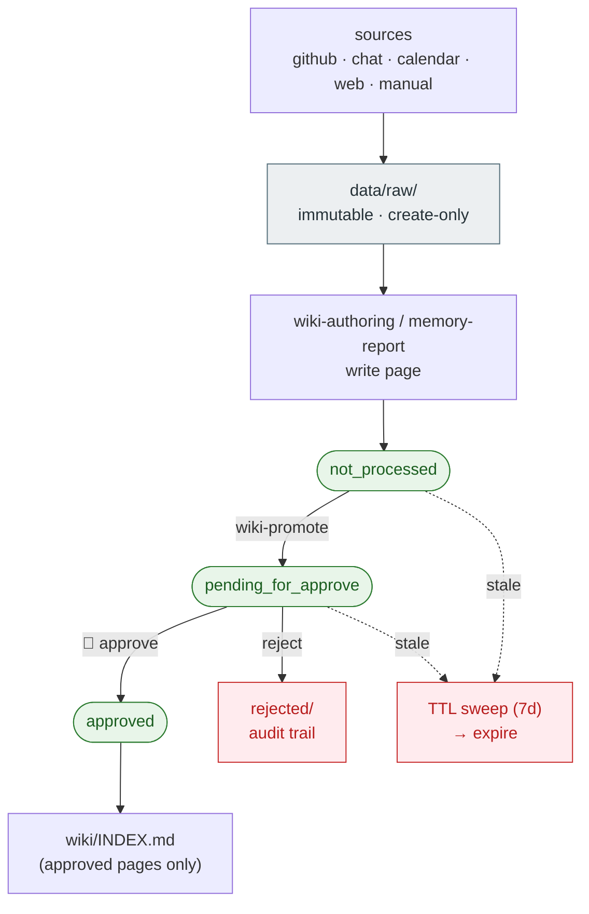

# Workflows (At-a-Glance Map)

Updated: 2026-06-02

## 1. Synopsis

- **Purpose**: Give a one-look mental model of how KnowledgeBase moves: what the
  nightly automation does, how a raw source becomes an approved wiki page, and how
  private data reaches `master`.
- **Scope**: Overview only. This is **not** an execution guide — every cron job's
  behavior is governed by a skill. For step-level detail, read the relevant
  `.claude/skills/<name>/SKILL.md` (see [§5](#5-where-the-detail-lives)).

## 2. Legend

The same conventions apply to every diagram below:

| Style | Meaning |
|---|---|
| 🟦 blue box | **Deterministic** job — pure CLI (`uv run kb-*`), no LLM |
| 🟪 purple box | **LLM-driven** job — runs `opencode run` against a skill contract |
| ⬦ diamond | **Gate / decision** (e.g. lint pass?) — blocks the flow on failure |
| 👤 | **Human-run** step (not a cron job) |
| dashed arrow | read-only / report (no artefact produced or moved) |

## 3. Nightly cron pipeline (KST)

The whole night collapses to: *collect → organize → DB write + export*,
with a separate morning read-out to Slack.

Intuition: nothing pushes mid-night — `cron-wrapup` (05:00) writes the night's
work through the DB API as one checkpoint. `ingest-daily-papers` (10:05) and the
`morning-slack-digest` (09:00, runs with the Hermes agent) sit outside the main chain.

## 4. Data flow & review lifecycle

How a captured source becomes durable, indexed knowledge — and what `INDEX.md` lists.

Intuition: `data/raw/` is write-once evidence; wiki pages climb an approval ladder
(`not_processed → pending_for_approve → approved`), and only **approved** pages land
in `INDEX.md`. Stale unprocessed/pending pages are swept by TTL; explicit rejections
are kept as an audit trail.

## 5. Two-repo sync (deprecated)

> The legacy git-based sync model (work branch → PR → merge) is deprecated
> following the DB-canonical migration. See `docs/db-canonical.md` for the
> current architecture.

## 6. Where the detail lives

This map is intentionally shallow. Each job's real contract — inputs, outputs, lint
order, edge cases — lives in its skill:

- LLM-driven jobs load their behavior from a `SKILL.md` at runtime
  (`memory-*` → `memory-report`; `wiki-promote` → `wiki-approval`;
  `cron-wrapup` → `cron-wrapup`).
- Deterministic jobs are CLIs, but their setup and operating contract are still
  documented in skills (e.g. usage reports → `usage-report-setup`).
- The legacy sync model (work branch → PR → merge) was owned by the `data-sync` skill (deprecated; see `docs/db-canonical.md`).

Browse `.claude/skills/` for the full set; read the matching `SKILL.md` for any box
in the diagrams above.
